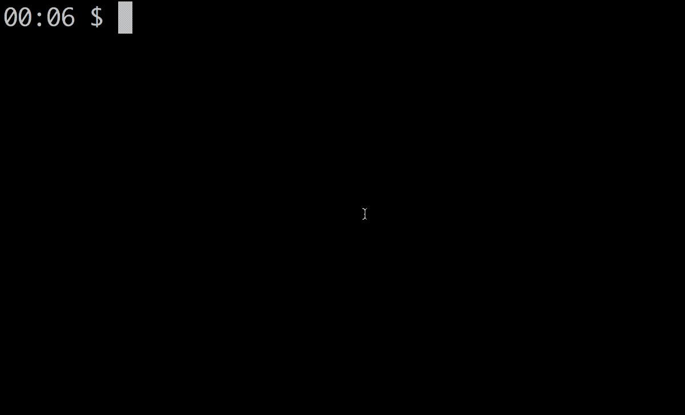

# English Accents CLI

[](https://travis-ci.org/ismaelgt/english-accents-cli)
[](https://www.npmjs.com/package/english-accents-cli)
[](https://david-dm.org/ismaelgt/english-accents-cli)
[](https://github.com/ismaelgt/english-accents-cli/blob/master/LICENSE)

Command-line interface for [English Accents Map](http://www.englishaccentsmap.com).

Watch YouTube videos of the English language spoken around the world.



## Installation

```
$ npm install -g english-accents-cli
```

## Usage

```
$ english-accents
```

## License

This project is licensed under the terms of the
[MIT license](https://github.com/ismaelgt/english-accents-cli/blob/master/LICENSE).
